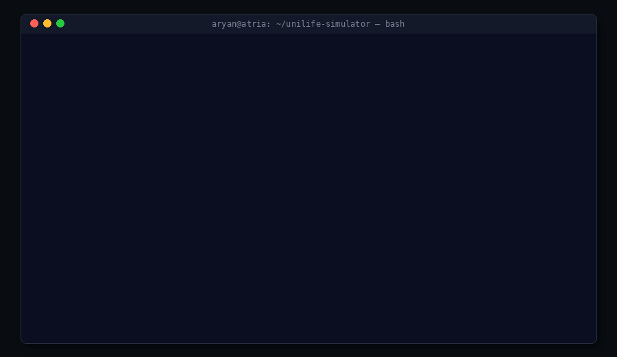

# UniLife Simulator: The Freshman's Fortune

> A terminal-based university life simulator where you balance academics, social life, wellbeing, and money over seven days.


---

## Overview

**UniLife Simulator** is a command-line game that simulates the first week of university life. You start as a freshman with limited time, limited money, and competing priorities: pass your quiz, maintain your social life, stay healthy, and survive the week without burning out.

Every action has trade-offs. Studying improves your academic score but drains wellbeing. Working earns money but costs energy. Partying boosts social score but hurts academics and cash. Your decisions compound over seven days.

---

## Demo



> The demo shows the terminal interface, status dashboard, playlist buffs, action resolution, and final outcome.

---

## Features

- **7-day game loop** with two actions per day
- **Four core stats:** Academic Score, Social Score, Well-being, and Cash
- **Probability-based action resolution** tied to your current wellbeing
- **Daily playlist buffs** including academic multipliers and wellbeing boosts
- **Task system** with deadlines, rewards, and missed-deadline penalties
- **Random end-of-day events** with temporary buffs and debuffs
- **Win/lose conditions** based on quiz performance, social health, burnout, and finances
- **Demo modes** for scripted winning and losing playthroughs
- **Terminal UX** with typewriter text, animated progress bars, and spinner animations

---

## How to Run

### Prerequisites

- Python 3.8 or newer
- No external libraries required — this project uses only the Python standard library

### Installation

```bash
git clone https://github.com/aryannvrao/unilife-simulator.git
cd unilife-simulator
```

### Run the game

```bash
python unilife.py
```

---

## How to Play

When the game starts, choose an option from the main menu:

```text
[1] Start a New Game
[2] Watch Demo: The Successful Student (WIN)
[3] Watch Demo: The Downward Spiral (LOSS)
[4] Exit
```

In a new game, you can perform actions such as:

```text
[1] Study at the Library
[2] Grab lunch with friends
[3] Go for a run
[4] Work a shift
[5] Go to a Party
[6] Play Video Games
[7] Check your To-Do List
```

Each action affects your stats differently. Your goal is to survive the week and pass your quiz.

---

## Game Mechanics

### Core Loop

Each day:

1. Choose your playlist for the day
2. Receive any active buff
3. Take up to two actions
4. End the day
5. Resolve missed deadlines and random events
6. Move to the next day

### Success Probability

Most actions use a probability system based on your current **Well-being** stat.

```text
Success Chance = Well-being / 100
```

If your wellbeing is high, your actions are more likely to succeed. If your wellbeing is low, even simple actions can fail. This creates a systemic trade-off: you cannot purely optimize for academics without maintaining mental and physical health.

### Winning Condition

At the end of Day 7, you win if:

- Academic Score is at least `60`
- Social Score is at least `30`
- Well-being is at least `30`
- Cash is greater than `0`

Otherwise, the game ends with a failure message.

---

## Technical Highlights

- Built with **pure Python** — zero external dependencies
- Uses a centralized `game_state` dictionary as the **single source of truth** for all game data
- Implements **probability-based action resolution** using `random.random()` compared against a wellbeing-derived success threshold
- Handles **stat clamping** (0–100), temporary buffs, task deadlines, and random events
- Features a **CLI UX** with typewriter text, animated progress bars, and spinner animations
- Includes **demo modes** for scripted winning and losing playthroughs

---

## Architecture

The game follows a state-driven loop:

```text
User Input
   ↓
Action Handler
   ↓
resolve_action()
   ↓
apply_stat_change()
   ↓
game_state update
   ↓
display_status()
   ↓
End of Day Processing
```

The entire game state lives in a single dictionary, making it easy to track stats, tasks, buffs, cash, and progression across days.

---

## Project Structure

```text
unilife-simulator/
├── unilife.py
├── README.md
├── .gitignore
├── requirements.txt
└── docs/
    └── demo.gif
```

---

## Known Limitations

- No save/load functionality yet
- Demo mode displays scripted text rather than replaying live game logic
- The `stress_reduction` playlist buff is defined but not yet wired into the action system
- Game balance could be improved with more playtesting

---

## Future Improvements

- Add save/load functionality
- Add more random events and tasks
- Add difficulty modes
- Implement the full stress-reduction system
- Add unit tests for game logic
- Refactor state handling into classes
- Add alternate endings and achievements

---

## Academic Context

This project was developed during the **Introduction to Python** sprint at **Atria University**.

The goal was to build an interactive terminal-based application using core Python concepts such as functions, dictionaries, lists, conditionals, loops, randomization, user input, and CLI formatting.

---

## Author

**Aryan Rao**

- LinkedIn: [https://www.linkedin.com/in/aryan-rao-254395307/](https://www.linkedin.com/in/aryan-rao-254395307/)
- GitHub: [https://github.com/aryannvrao](https://github.com/aryannvrao)

---

## License

This project is shared for educational purposes.
